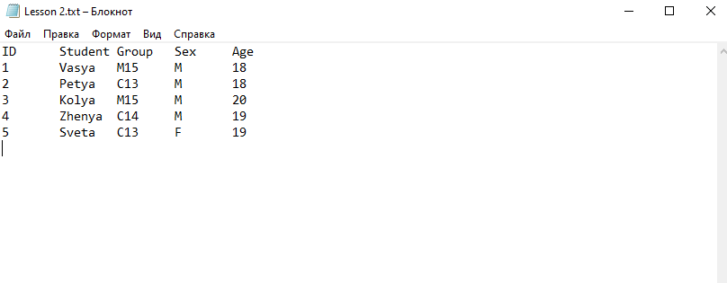
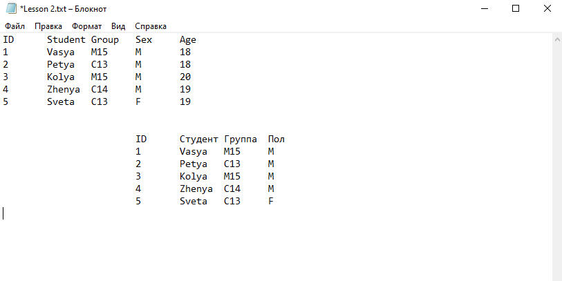
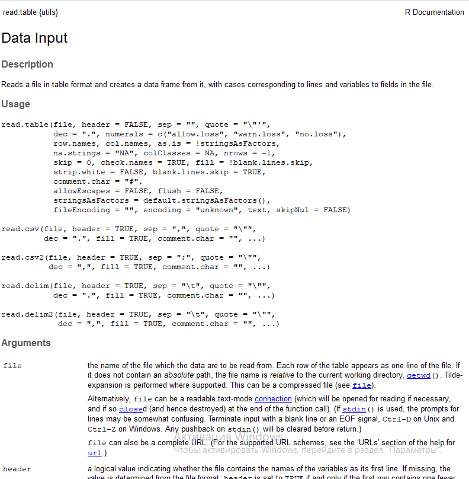
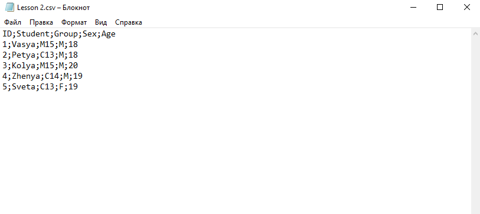
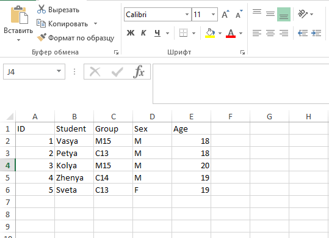
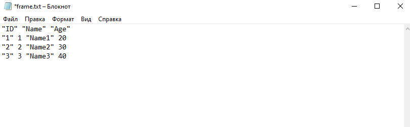
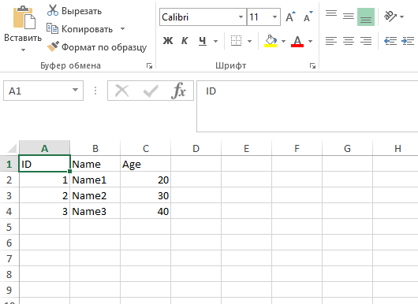
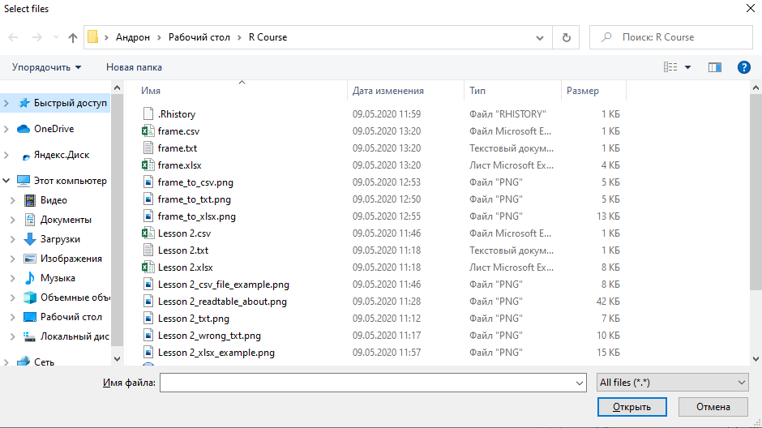

```{r setup2, include=FALSE}
knitr::opts_chunk$set(echo = TRUE)
```

# Часть 2 Загрузка данных

В предыдущей лекции мы изучили основные типы и структуры данных, теперь мы можем потихоньку переходит к работе с ними. Но для этого, в первую очередь, необходимо научиться загружать данные из внешних источников - таблиц xlsx, csv, txt и других форматов. До этого мы генерировали "эксперементальные" данные вручную, прям по мере выполнения кода, но в жизни такое будет редко - в основном, вся информация будет храниться в базах данных или табличных файлах. 

## Загрузка txt-файлов

Пожалуй, начнем с самого простого. Пусть наша таблица хранится в обычном файле-блокноте в формате txt. Для того, чтобы загрузить такой файл, нам не нужно подключать никакие дополнительные библиотеки - все необходимые функции для работы с такими файлами уже доступны "из коробки". 

Допустим, у нас есть txt-файл с таким содержимым: 




**Замечание.** Обратите внимание на структуру Вашего файла - он должен содержать только одну правильно оформленную таблицу. В противном случае, могут возникать разного рода ошибки. Например, вот так делать не надо: 





Итак, файл готов и правильно оформлен, давайте загрузим его в среду программирования с помощью команды ```read.table()```. 

```{r try_readtable}
df <- read.table(file = 'Lesson 2.txt')
str(df)
```

Обратите внимание - наша таблица загрузилась не совсем так, как нам хотелось бы: 

- Названия столбцов загрузились как строка таблицы, а не как заголовки 
- Все наши столбцы имеют тип ```factor```, что будет не очень удобно в дальнейшем

Чтобы избежать этих и многих других сложностей при загрузке, у функции ```read.table()``` есть большое количество аргументов. Подробнее со всеми ними Вы можете разобраться, почитав справку с помощью ```?read.table```: 





Мы же рассмотрим только несколько аргументов, которые нас интересуют в данный момент - ```header``` (по умолчанию стоит ```FALSE```) и ```stringAsFactors```. 

```{r correct_readtable}
#Читаем таблицу. Говорим, что первая строка - заголовки. Также даем команду - символьные поля не надо переводить в factor.
df <- read.table(file = 'Lesson 2.txt', header = TRUE, stringsAsFactors = FALSE)
str(df)
```


Теперь мы видим, что вся таблица загружена правильно - присутствуют заголовки, а текстовые поля загрузились как ```character```. 

У ```read.table()``` есть еще большое количество полезных аргументов, которые Вы так или иначе будете использовать. Например, ```sep``` для установки знака-разделителя, ```dec``` для установки разделителя разряда в числах, ```skip``` для пропуска строк и много других. У них у всех есть значения по умолчанию, так что почитайте справку. Либо же придется набивать шишки на опыте :) 

## Загрузка csv-файлов 

А что если наша таблица хранится в виде csv-файла? Не проблема - у нас также прям в базовом функционале есть функция для чтения csv-файлов: ```read.csv()```. 

Она своими аргументами очень похожа на ```read.table()```, поэтому сильно подробно останавливаться на этом не будем. При необходимости, открываем справку ```?read.csv```, а мы пока рассмотрим пример. 

Пусть у нас есть такой csv-файл: 





Давайте попробуем загрузить его с помощью ```read.csv()```: 

```{r first_readcsv}
df <- read.csv(file = 'Lesson 2.csv')
df
```

Вы видите, что все наши данные загрузились в один столбик - т.е. у нас получилась не таблица, а один столбец. Почему так? Все просто - по умолчанию у функции ```read.csv()``` аргумент ```sep = ","```. А в нашей таблице разделители - ```";"```. Соответственно, указываем дополнительный аргумент ```sep``` при загрузке, а также добавляем ```stringAsFactors``` и все становится правильно:

```{r correct_readcsv}
df <- read.csv(file = 'Lesson 2.csv', sep = ";", stringsAsFactors = FALSE)
str(df)
```

Теперь наша таблица загрузилась правильно - и заголовки есть, и все поля загрузились с правильным типом данных. 

## Загрузка xlsx-файлов

С файлами Microsoft Excel все чуть более интересно - таблицы ```xlsx``` формата встречаются очень часто, а вот функции для загрузки таких файлов в стандартном наборе нет. Но не проблема - достаточно подключить какую-ниубдь библиотеку и это решит все наши проблемы!

Лично мне нравится библиотека ```xlsx```: 

```{r connect_xlsx_1, include = FALSE}
library(xlsx)
```


```{r connect_xlsx, eval = FALSE}
#Устанавливаем пакет xlsx
install.packages('xlsx')
#Подключаем установленный пакет
library(xlsx)
```

Далее все просто - теперь мы можем считывать наши xlsx-файлы с помощью функции ```read.xlsx()```. Пусть у нас есть такой файл: 





Загрузим его в рабочую среду с помощью функции ```read.xlsx()```. 

```{r read.xlsx}
df <- read.xlsx(file = 'Lesson 2.xlsx', sheetIndex = 1, stringsAsFactors = FALSE)
str(df)
```

Здесь обязательных агрументов 2 - ```file``` и ```sheetIndex``` - порядковый номер листа в книге Excel. Также мы можем указывать дополнительные аргументы, например: 

- ```sheetName``` - вместо номера листа можем указать его имя
- ```rowIndex``` - номера строк, которые мы хотим загрузить с листа
- ```colIndex``` - номера столбцов, которые мы хотим загрузить с листа
- ```header``` - загружать ли заголовки? 
- ```encoding``` - кодировка
- многое другое, как специфичных аргументов функции ```read.xlsx()```, так и общих для всего семейства функций ```read.какой-то формат()```

Еще один вариант загрузки xslx-файлов в рабочую среду - использовать пакет ```readxl```. Основное отличие функции ```read_excel()``` от ```read.xlsx()``` из пакета ```xlsx```, который мы только что рассмотрели, - результат мы получаем не в виде фрейма, а в виде специального табличного формата - ```tibble```. Сам по себе ```tibble``` - как бы более удобный вариант ```data frame```, который был создан разработчиками языка ```R``` специально для удобства и функциональности обработки данных. Вокруг этого формата построено целое семейство пакетов для загрузки, очистки и обработки данных - пакеты ```tidyverse```. 

```{r connect_readxl_1, include = FALSE}
library(readxl)
```

Загрузим нашу таблицу с помощью ```read_excel()``` из пакета ```readxl```. 

```{r connect_readxl_2, eval = FALSE}
#Устанавливаем пакет xlsx
install.packages('readxl')
#Подключаем установленный пакет
library(readxl)
```

```{r read_excel}
df <- read_excel('Lesson 2.xlsx')
df
```

Обратите внимание, мы не указали никаких дополнительных аргументов, но все загрузилось правильно - и заголовки, и формат данных везде правильный. Именно под это и заточены функции из пакетов ```tidyverse``` - максимально облегчить жизнь аналитикам и исследователям. 

## Пакет readr

Пакет [```readr```](https://rawgit.com/rstudio/cheatsheets/master/data-import.pdf) - специальная библиотека из семейства ```tidyverse``` для загрузки и сохранения данных. Позволяет считывать файлы с табличной структурой (например, csv-файлы) или файлы с произвольной структурой (например, чтение произвольных строк с записью в вектор), а также записывать результаты в файлы самых разных форматов с помощью функций ```write_формат()```. 

Из особенностей этой библиотеки - например, она как бы "угадывает" тип данных в каждом столбце таблицы и выполняет преобразование, если нужно. Именно поэтому в предыдущем примере нам не пришлось указывать аргумент ```stringsAsFactors``` для корректной работы, ведь пакет ```readxl``` построен по тому же принципу!

## Запись в файл 

Ранее мы говорили с Вами о загрузке данных в систему, но что насчет выгрузки? Как сохранять результаты своей работы в виде таблиц или файлов разного формата? 

Как и для загрузки, для этого существует большое количество функций из разных библиотек - некоторые идут в базовом наборе, некоторые нужно подключать с отдельными пакетами, некоторые включены в пакет ```readr```. Учитывая, что логика записи такая же, как у чтения, давайте просто рассмотрим несколько примеров. 

Для начала, сгенерируем фрейм, который будем записывать: 

```{r frame_generation}
df <- data.frame(
  ID = 1:3, 
  Name = c("Name1", "Name2", "Name3"), 
  Age = c(20, 30, 40))
df
```

Теперь запишем cозданный фрейм в разные форматы: txt, csv и xlsx, - и посмотрим, что получилось. 

```{r frame_to_txt, results = 'hide'}
#Стандартная функция из базового пакета
write.table(df, 'frame.txt')
```





```{r connect_readr_1, include = FALSE}
library(readr)
```

```{r frame_to_csv, results = 'hide'}
#Функция write_csv из пакета readr
write_csv(df, 'frame.csv')
```


```{r frame_to_xlsx, results = 'hide'}
#Функция write.xlsx из пакета xlsx
write.xlsx(df, 'frame.xlsx', row.names = FALSE)
```





Как Вы видите, ничего сложного нет. В общем случае достаточно указать просто *что мы записываем* и *куда мы записываем*. Естественно, есть и множество дополнительных аргументов - номера и названия листов (в случае книг Excel), именование строк и столбцов, кодировки, режим добавления строк/перезаписи и многое другое! Подробней ознакомиться с каждой функцией с помощью справки и на официальных сайтах каждой библиотеки (если такие имеются). 

## Как быть с другими форматами? 

У Вас может возникнуть резонный вопрос - а как быть с другими форматами данных? Не всегда же информация хранится в таблицах - бывают различные SPSS и SAS - файлы, json, XML, HTML, базы данных и разные другие форматы. Общая рекомендация такая - используем специальные библиотеки. Практически на все самые популярные форматы и источники есть какие-то пакеты и обертки, позволяющие достаточно просто и удобно работать с этими источниками. Например: 

- пакет ```haven``` для SPSS, Stata и SAS файлов
- пакет ```jsonlite``` для json 
- ```xml2``` для XML
- ```rvest``` для HTML 

Само собой, все исходит от Вашей задачи и библиотеку нужно подбирать под Ваши конкретные потребности. Все придет с опытом :) 

## Полезные добавления

Хотелось бы обратить Ваше внимание еще на несколько полезных вещей, которые напрямую с нашей темой не связаны, но определенные проблемы и вопросы могут вызывать. 

### Работа с директориями 

Во всех функциях при загрузке-выгрузке данных мы указываем путь к файлу. Однако, во всех примерах мы предполагали, что наши файлы лежат в рабочей папке. И тут возникают два вопроса: 

- Как узнать, какая папка рабочая? 
- Как поменять рабочую папку? 

Естественно, Вы можете каждый раз до каждого файла прописывать полный путь, например, "C:\Users\User1\Desktop\R Course\file.txt". Однако, сами понимаете, это не особо удобно. Если у нас все рабочие файлы лежат плюс-минус в одной папке, почему бы просто не сделать ее рабочей? 

Итак, отвечаем на первый вопрос: чтобы узнать, какая директория у нас рабочая, нужно использовать команду ```getwd()```: 

```{r getwd}
getwd()
```

Отвечаем на второй вопрос: чтобы поменять рабочую директорию, достаточно использовать команду ```setwd()``` с указанием пути до желаемой рабочей директории. 

```{r setwd_1}
setwd("C:/Users/Андрон/Desktop")
getwd()
```

Или так: 

```{r setwd_2, include = FALSE}
setwd("C:/Users/Андрон/Desktop/R Course")
```

```{r setwd_3}
setwd("../")
getwd()
```

Конструкция ```"../"``` значит, что мы выходим из текущей папки на один уровень вверх. Так мы можем делать, если нам известна структура наших папок. Я знаю, что папка ```R Course```, в которой лежит мой проект, находится в папке ```Desktop```. Соответственно, я просто поднимаюсь на один уровень выше, и теперь моя рабочая папка - ```Desktop```. 

Зная эти две команды, Вы сможете гибко настраивать рабочие директории. По такому же принципу Вы можете прописывать и пути в функциях загрузки/сохранения. Например, чтобы сохранить наш фрейм не в рабочую папку, а в ```Desktop```, мне надо прописать: 
```{r frame_to_xlsx_desktop, results = 'hide'}
write.xlsx(df, '../frame.xlsx', row.names = FALSE)
```

Мы изменили путь к файлу ```frame.xlsx``` и теперь он появится не в рабочей директории, а в нужной папке. 

### Выбор файла вручную

А что, если Вам нужно реализовать какую-то программу, которая будет загружать файл не по названию, а после того, как Вы его выбрали? Не проблема! Для этого существует специальная функция ```choose.files()```. Работает она очень просто: 

```{r choose.file, eval = FALSE}
read.table(file = choose.files())
```

После чего перед Вами появляется стандартное окошко выбора файлов: 




Таким образом, Вы сможете выбирать все нужные Вам файлы вручную. Такая функция может потребоваться, например, при разработке каких-то аналитических приложений. 

## Заключение

Мы рассмотрели весь основной функционал загрузки и сохранения данных с помощью функций R и различных пакетов достаточно подробно. Теперь мы можем переходить на следующую стадию - обработка данных. 